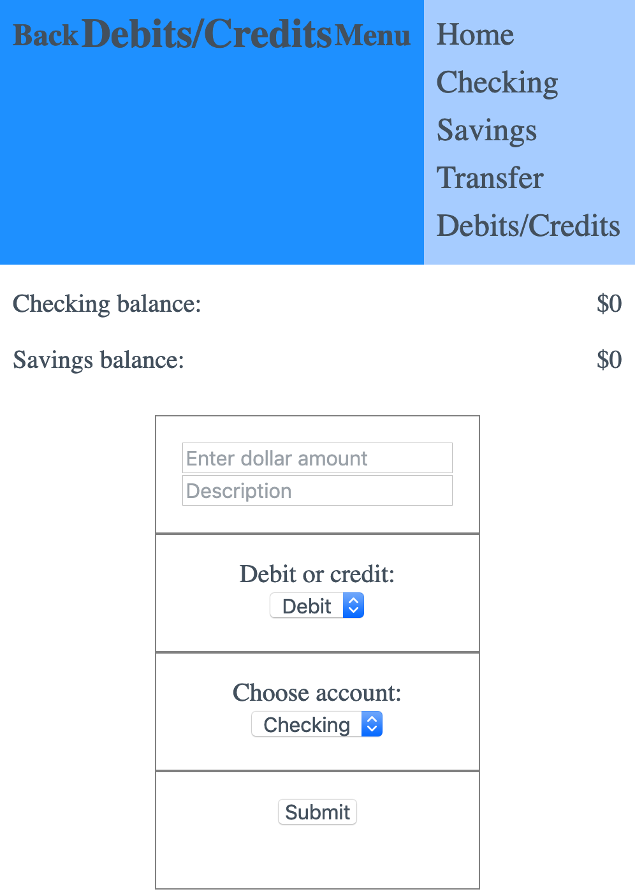
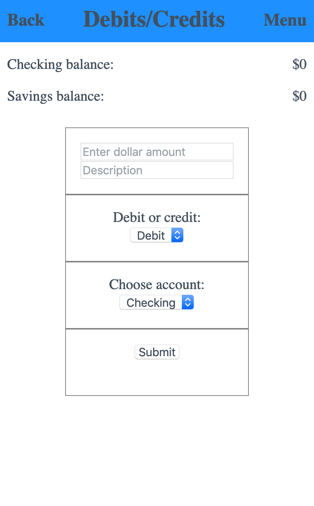
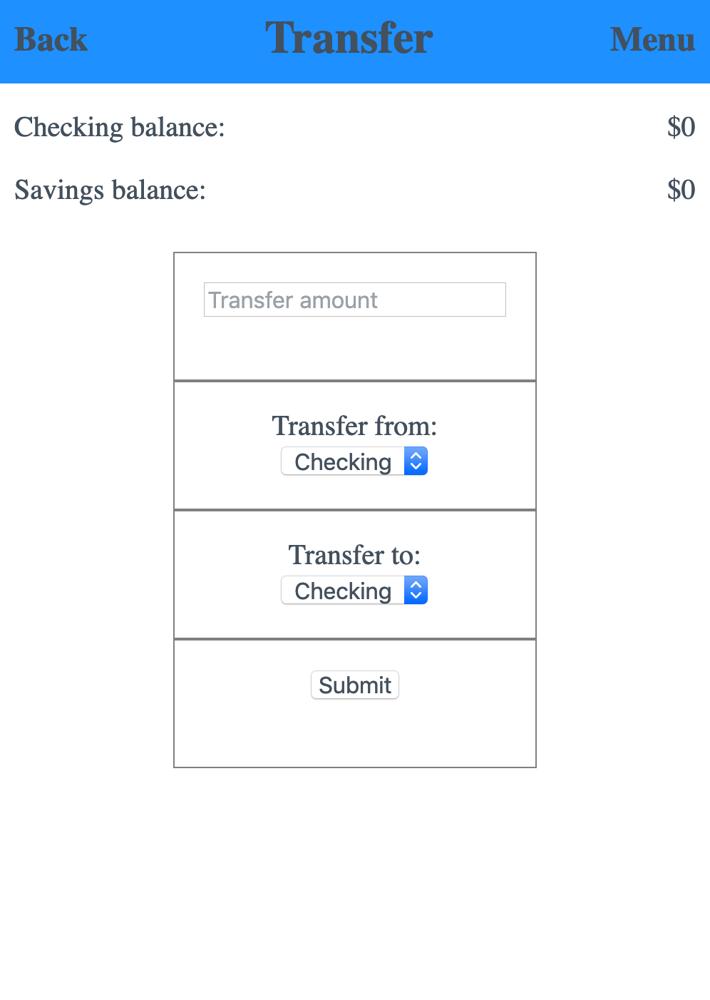
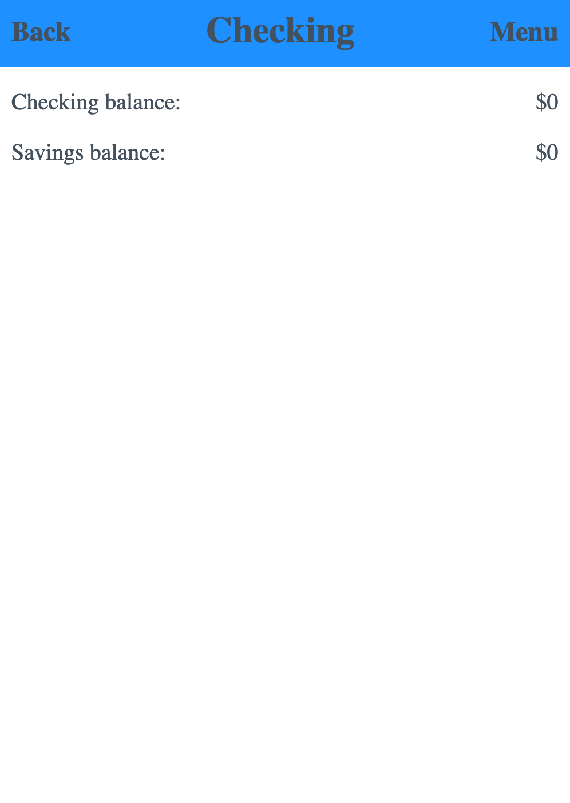

# final-project

Hello. This is my final project for term 1 of the web development immersive course at Code Immersives. The object of this project was to showcase what I've learned throughout the term by creating a CRUD app.

I decided to create a bank account tracker. This is a standalone app, so it does not connect to an actual bank or account, but it can act as a sort of ledger for transactions such as debits, credits, and transfers.

This is the home/start page:

From here you can choose any of the listed options. 

At any point during use, you can move to another page by using the 'Menu' at the upper-left corner of the screen.

If it is your first time using the app, it is necessary to choose 'Debit / Credit' in order to create a starting balance for your account(s).

From here, enter an amount (numbers and decimal only), enter a description in the 'Description' field, choose 'Credit' (initial use) from the 'Debit or credit' dropdown menu, select checking or savings from the following dropdown menu, then click 'Submit'. Your balance will update accordingly. If you have used the app before, or once you have entered a starting balance, you can choose 'Debit' in order to show deductions from your account(s).

You can also track transfers between accounts using the transfer page. The directions for transfers is similar to credits/debits, only without the description field.

Finally, choose 'Checking' or 'Savings' from the home page, or from the menu in order to view a list of your transactions, along with descriptions and dates.

Thank you for taking a look at my project.

